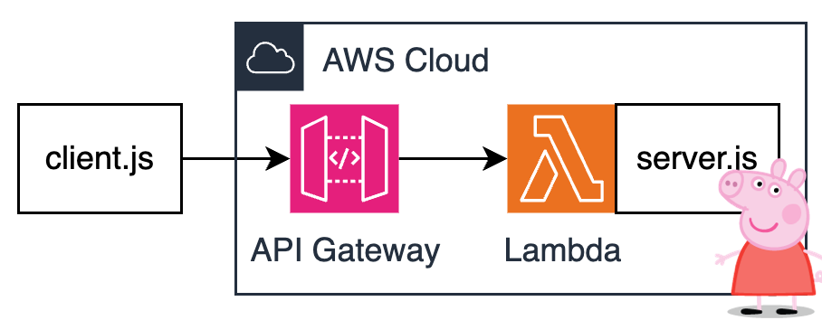

# Peppa MCP Server on Lambda

Check out the [Building Serverless MCP Servers and What Does Peppa Pig Have To Do With It](https://www.ranthebuilder.cloud/post/building-serverless-mcp-server) blog for the full story. 

--

A Peppa MCP Server running natively on AWS Lambda and Amazon API Gateway without any extra bridging components or custom transports. This is now possible thanks to the [Streamable HTTP](https://modelcontextprotocol.io/specification/2025-03-26/basic/transports#streamable-http) transport introduced in v2025-03-26. 

Architecture is as simple as it gets: 


## Prereqs

* AWS CLI
* Terraform 

## Instructions

Install dependencies:
```bash
cd src
npm install
cd ..
```

Bootstrap server and set env var with MCP Server endpoint:
```bash
cd terraform
terraform init
terraform plan
terraform apply
export PEPPA_MCP_SERVER_ENDPOINT=$(terraform output --raw endpoint_url) 
cd ..
```

> Note: It might take a few seconds for API Gateway endpoint to become operational. 

Run client:
```bash
node src/client.js
```

Observe the response:
```bash
> node client.js
listResources response:  {
  resources: [
    {
      uri: 'peppa://timeslots',
      name: 'timeslots',
      description: 'Use this resource to get all open timeslots for ordering tickets     to the Peppa Pig Theme Park.',
      mimeType: 'text/plain'
    }
  ]
}
readResource response:  {
  contents: [
    {
      uri: 'peppa://timeslots',
      mimeType: 'text/plain',
      text: 'Available timeslots are: April 19th 2025, April 20th 2025, April 21st 2025'
    }
  ]
}
listTools response:  {
  tools: [
    {
      name: 'order-tickets',
      description: 'Use this tool to order tickets to the Peppa Pig Park.     The tool expects two parameters - timeslot and quantity.     The timeslot should be a stringified date.     The quantity should be a number.         Example:     order-tickets(timeslot: "April 19, 2025", quantity: 3)         The tool will return a text message with the order number.     ',
      inputSchema: [Object]
    }
  ]
}
callTool response:  {
  content: [
    {
      type: 'text',
      text: "You've ordered 3 tickets for April 19th, 2025.         Your order number is OINK-1234."
    }
  ]
}
```

## Learn about mcp
[Intro](https://modelcontextprotocol.io/introduction)

[Protocol specification](https://modelcontextprotocol.io/specification/2025-03-26)
